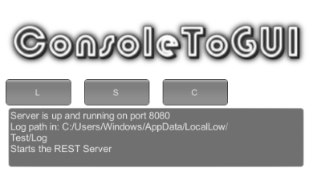

# ConsoleToGUI

Small script to generate a log file with all the information from the Unity Debug.Log console, it also includes the option to show a Textbox Log in aplication UI.

## Features

- Create log file in app path o local resourses path
- Vervose Debug with stacktrace
- Display in UI or silent mode.

## Others

- FPSDisplay.cs for display framerate on UI
- FlyCamera.csm for simple wasd and mouse camera control for test scenes
- Utils.cs some useful functions

## Use 

Copy to assets folder and add it to any gameobject
